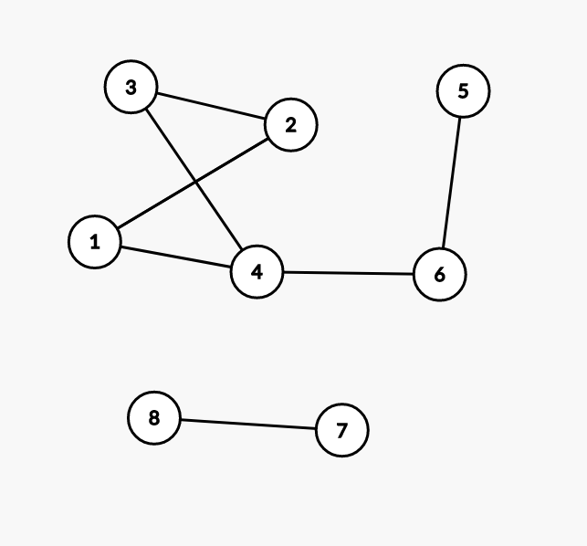
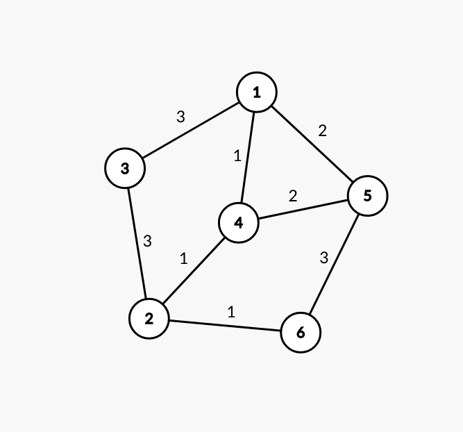

<h2> Contest 4. Пошук в ширину </h2>

Минулий контест розглядав загальні способи пересування та обходів графі для вирішенння радше штучно виведених задач. В цій лекції ми розглянемо задачі на знаходження найкоротшого шляху в графі в порядку ускладнення.

<h3> 1. Всі ребра в графі однієї довжини </h3>

Розглянемо приклад з минулої лекції: 



Найкоротшим шляхом з вершини $x$ в вершину $y$ називають глях, який маэ найменшу кількість ребер. Наведемо декілька прикладів.

Від вершини 3 до вершини 5 є шляхи 
- 3 -> 2 -> 1 -> 4 -> 6 -> 5
- 3 -> 4 -> 1 -> 2 -> 1 -> 4 -> 6 -> 5
- 3 -> 4 -> 6 -> 5

Очевидно, що можна придумати ще більше шляхів, але це не має сенсу, оскільки найкоротшим шляхом є шлях `3 -> 4 -> 6 -> 5`. 

Як знаходити цей найкоротший шлях? Для цього є алгоритм пошука в ширину. 

Покажемо ідею алгоритма для пошуку найкоротших шляхів з вершини 1. 

0. Скажемо, що довжина шляху до всіх вершин крім першої на початку дорівнює $+\infty$. 

$d = [0, \infty, \infty, \infty, \infty, \infty, \infty, \infty]$

1. Знайдемо всі вершини з найменшою відстанню від вершини 1. Це наразі вершина 1. Пройдемося по всіх її ребрах і оновимо відстань до всіх суміжних вершин.  Доступні ребра - це ребра `(1, 2), (1, 4)`.

$d = [0, 1, \infty, 1, \infty, \infty, \infty, \infty]$

**Тут основна різниця між пошуком в глибину і в ширину. Пошук в глбиниу іде в кожну суміжну вершину, а пошук в ширину агрегує всі вершини на якійсь відстані.**. Картинка нижче іллюструє цей принцип.


2. Тепер, знайдемо всі вершини на відстані 1 від початкової. Це вершини `[2, 4]`. Доступні ребра - це ребра `(2, 3), (2, 1), (4, 1), (4, 3), (4, 6)`. Оновивши відстані ми маємо: 

$d = [0, 1, 2, 1, \infty, 2, \infty, \infty]$


3. Тепер вибираємо всі вершини з відстанню 2. Це вершини `(3, 6)`. Ребра - `((3, 2), (3, 4), (6, 4), (6, 5))`. 

$d = [0, 1, 2, 1, 3, 2, \infty, \infty]$. 

Наступні переходи по ребрах не будуть змінювати відстані - ми знайшли вектор відстаней від кожної вершини до стартової вершини 1. 

**Як це написати?**

Ми будемо підтриувати чергу з вершин, до яких найменша відстань від стартової - чергу `q`. 

```
int s; cin >> s; // вводимо стартову вершину. 
vector<int> d(n, 10000000); // вектор відстаней заповнений великими числами 
d[s] = 0; // відстань до неї дорівнює 0. 
queue<int> q; // черга вершин за відстаню. 
q.push(s); // на початку має лише стартову вершину 

while(!q.empty()) { // поки є вершини в черзі
    int v = q.pop(); // вибираємо першу
    for (int u : g[v]) { // проходимо по всіх ребрах
        if (d[u] > d[v] + 1) { // якщо відстань покращується 
            q.push(u); // то додаємо в чергу
            d[u] = d[v] + 1; // і оновлюємо відстань 
        }
    }
}
```

Код відносно простий і основне - працює лінійно від розміру графа. 

<h3> Є довжини ребер. Алгоритм дейкстри </h3>



Якщо в графі наявні довжини ребер, ми можемо реалізувати схожу версію алгоритма. А саме - ми будемо на кожному кроці знаходити вершину з найменшою відстанню від початкової і оновлювати відстані. Щоб не повторювати вершини, будемо додатково зберігати масив `used` - в ньому буде зберігатися інформація про використання вершин. 

Розглянемо алгоритм на прикладі цього графу з стартової вершини 1.

- Крок 1. d = [0, 100, 100, 100, 100, 100]. u = [false, false, false, false, false, false]. Найкраща вершина = {1}
- Крок 2. [0, 100, 3, 1, 2, 100]. u = [true, false, false, false, false, false] Найкраща вершина = {4}
- Крок 3. [0, 2, 3, 1, 2, 100]. u = [true, false, false, true, false, false] Найкраща вершина = {2/5}. Нехай буде 5. 
- Крок 4. [0, 2, 3, 1, 2, 5]. u = [true, false, false, true, true, false] Найкраща вершина = {2}
- Крок 5. [0, 2, 3, 1, 2, 3]. u = [true, true, false, true, true, false] Найкраща вершина = {3/6}. Нехай 6
- Крок 6. [0, 2, 3, 1, 2, 3]. u = [true, true, false, true, true, true] Найкраща вершина = {3}
- Крок 7. [0, 2, 3, 1, 2, 3]. u = [true, true, true, true, true, true]. Вершини закінчилися.


**Як писати?**

```
int s; cin >> s; // вводимо стартову вершину. 
vector<int> d(n, 10000000); // вектор відстаней заповнений великими числами 
vector<bool> used(n, 0); // масив використаних вершин
d[s] = 0; // відстань до неї дорівнює 0. 

while(true) { // завжди
    int v = -1; // знаходимо найкращу вершину
    for (int i = 0; i < n; i++)  {
        if (used[i]) continue; // якщо використана, не підходить
        if (v == -1 || d[i] < d[v]) v = i; // оновлюємо вершину, якщо стало краще 
    }
    if (v == -1) break; // вершини закінчилися
    used[v] = true; // використовуємо вершину

    for (int [u, len] : g[v]) { // проходимо по всіх ребрах
        if (d[u] > d[v] + len) { // якщо відстань покращується 
            d[u] = d[v] + len; // і оновлюємо відстань 
        }
    }
}
```

Як ми бачемо, цей алгоритм працює схоже до поперднього. Але час роботи вже не лінійний, а квадратичний - $O(n^2)$. 

Існує більш швидка реалізація, яка використовує множини і досягає часу $O(m \log (n + m))$. 

<h3> Додаткові матеріали </h3>

- https://cp-algorithms.com/graph/01_bfs.html  (*)
- https://cp-algorithms.com/graph/dijkstra.html
- https://cp-algorithms.com/graph/dijkstra_sparse.html (*)
- https://cp-algorithms.com/graph/breadth-first-search.html